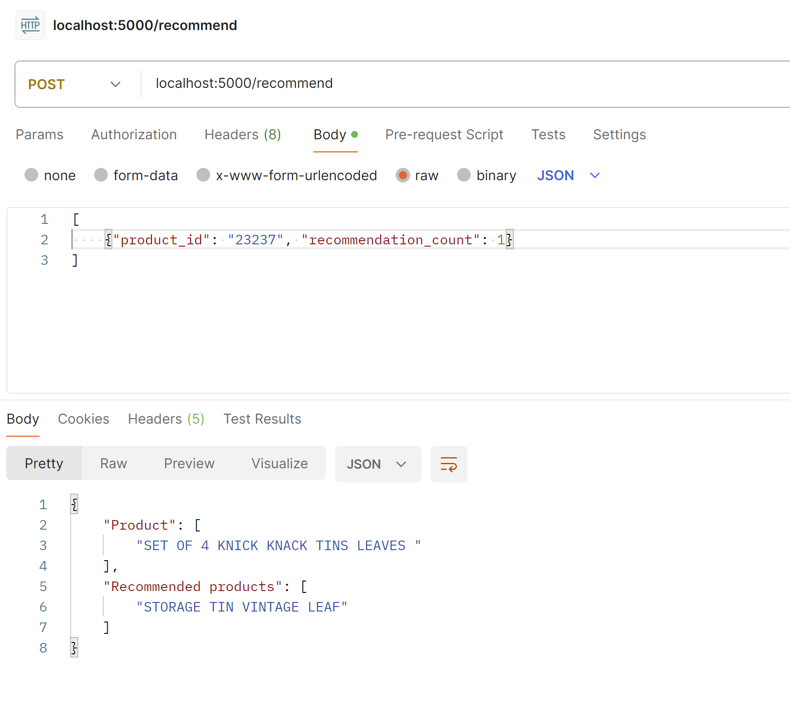

# Bundle Recommendation System
This is the source code repository for the recommender system using Associate Rule Mining (ARM) algorithm called FP-Growth. 

This project implements a rule based machine learning algorithm for finding patterns and enabling product bundle recommendations. ARM discovers strong rules in database using different measures of associations. It discovers rules that determine groups of items that are connected. This project uses a publicly available E-commerce dataset found [here](https://www.kaggle.com/datasets/carrie1/ecommerce-data). 


# Tutorial
## Requirements
- python 3.10
- mlxtend 0.22.0
- pandas 1.5.3
- Flask 3.0.2

## Running the code
This project consists of two folders and a package.
- Folder ```recommender_system``` consists of an implementation of a FP-Growth algorithm to obtain the bundle recommendations for a given product ID along with the price of the bundle. 
- Folder ```rest_api_implementation``` consists of an implementation of a Rest API to provide recommendations for a given product ID.
- A package ```bundle_recommendation``` provides the dockerized version of the implemented API.

### recommender_system
The folder includes the data required to train the FP-Growth algorithm.
The bundle recommendations can be generated by running:
```
python3 recommendation_algo.py --productID '22747' --b 4 
```
This will recommend 4 bundles (```--b 4```) with high 'Lift' for the product ID '22747'. It also computes the price per bundle (in Sterling) by summing the price of each product within the bundle. The recommendations will be logged into ```info.log```. The user can also specify the name of the logfile with the command line argument ```--logfile ```.

### rest_api_implementation
The folder contains the data (```filtered_dt.pkl```) and association rules (```rules.pkl```) required to run the API.
The API can be launched by running:
```
python3 main.py
```
This will run the Flask app in localhost with port 5000. You can test the API using Postman.
Below example shows the query format and the expected output format.




### Dockerized version
A dockerized version of the above API can be found in the packages. The folder ```rest_api_implementation``` contains all the files required to build the dockerized image. 
